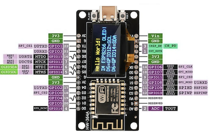
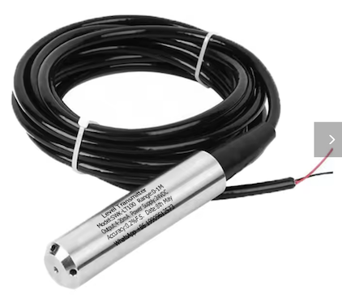
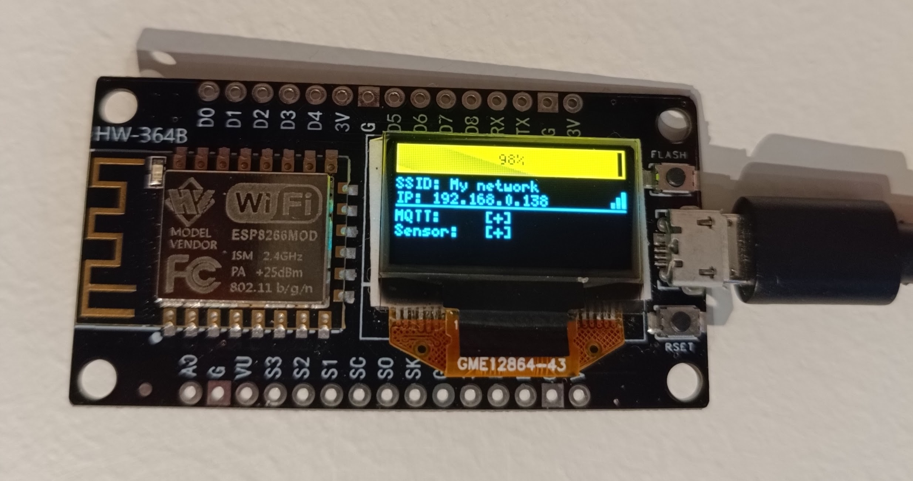
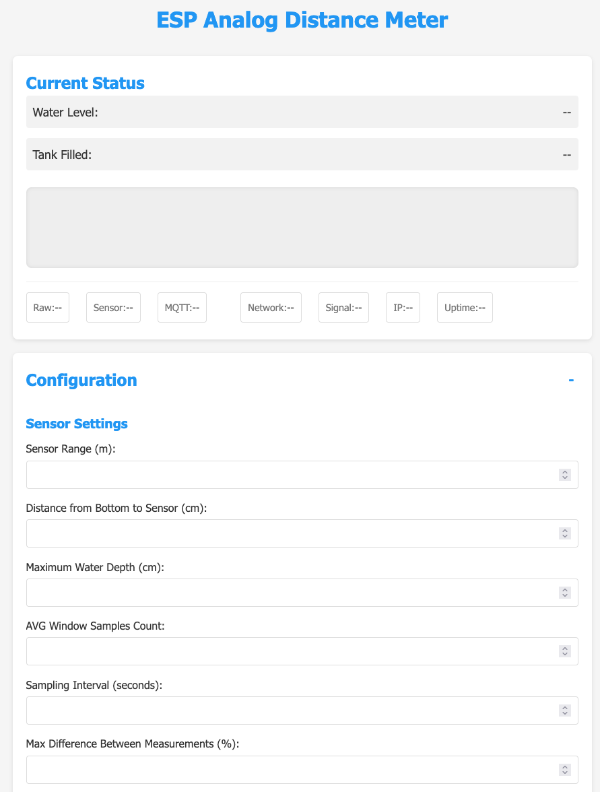

# ESP8266 Analog distance meter

Allows you to measure absolute & relative distance from an analog 0-10V or 4-20mA sensor and send it to MQTT.
It also provides HomeAssistant sensor autodiscovery.

This project was inspired by [WaterLevelSensorMQTT](https://github.com/portfedh/WaterLevelSensorMQTT).

## Required components

* NodeMCU ESP8266 Development Board ~4EUR
  * Recommend buying the one with built-in 0.96in display
* Any analog sensor, I used SWK-LT100 ~40EUR





Final result



## 4-20mA to 0-3.3V Conversion Circuit

Most industrial 4-20mA sensors, including the SWK-LT100, require a 24VDC power supply to operate correctly. The sensor acts as a variable current sink in the loop, where the current drawn (4-20mA) represents the measured value. 

If you need to build your own 4-20mA to 0-3.3V converter circuit to connect this sensor to an ESP8266, here's how you can do it:

### Components needed

#### For Minimal Circuit
* 160Ω or 150Ω precision resistor (standard E24 value, 1% tolerance recommended, 1/4W or higher)
* Alternative: 150Ω + 10Ω in series (equals 160Ω)

#### Additional Components for Enhanced Protection Circuit
* 10nF capacitor for noise filtering
* 3.6V Zener diode for overvoltage protection

### Circuit Schematics

#### Minimal Circuit

```
4-20mA Sensor Loop
     |   |
    (-) (+) ----+----------> To ESP8266 ADC
     |          |
     |         .-.
     |         | | 160Ω
     |         '-'
     |          |
    (-) (+) ----+----------> To ESP8266 GND
```

This minimal circuit is all you need to convert a 4-20mA current signal to a voltage suitable for the ESP8266 analog input.

#### Enhanced Protection Circuit

```
4-20mA Sensor Loop
     |   |
    (-) (+) ----+---------+--------+-------> To ESP8266 ADC
     |          |         |        |
     |         .-.        |        | 
     |         | | 160Ω  === 10nF  └-Z<|-┐ Vz 3.6V
     |         '-'        |              |
     |          |         |              |
    (-) (+) ----+---------+--------------+-> To ESP8266 GND
```

### How it works

#### Basic Circuit
The circuit uses Ohm's Law: V = I × R

With a 160Ω precision resistor:
* 4mA × 160Ω = 0.64V (lower range)
* 20mA × 160Ω = 3.2V (upper range)

With a 150Ω precision resistor:
* 4mA × 150Ω = 0.6V (lower range)
* 20mA × 150Ω = 3.0V (upper range) - slightly lower than ESP8266's 3.3V ADC range

Both standard resistor values provide a good mapping to the 0-3.3V input range of the ESP8266's analog pin. The 160Ω resistor stays safely under the maximum ADC voltage, while the 180Ω resistor provides slightly better resolution but may exceed the maximum input voltage at 20mA.

#### Protection Components in the Enhanced Circuit

1. **10nF Capacitor**: Filters out high-frequency noise from the sensor signal and stabilizes the ADC input

2. **3.6V Zener Diode**: Protects against overvoltage conditions by clamping the voltage to 3.6V, preventing damage to the ESP8266's analog input

### Notes

* Ensure precise resistor values for accurate readings
* Keep wires short to minimize electrical noise
* For industrial applications, consider adding additional protection like an optocoupler
* If your sensor provides more than 20mA in fault conditions, add a 3.6V Zener diode for overvoltage protection

## Setup

1. Connect the analog sensor output to the signal converter, and connect the converter's output to the `A0` pin on the ESP8266. Power the sensor according to its specifications.
2. Optional 128x64 OLED display can be connected - `D5` as `SCL` and `D6` as `SDA`. With a built-in display it works out of the box.
3. At first, the `WiFiManager` will set up an AccessPoint, connect to `ESP_distance_meter` WiFi, and then configure connection to your local network. Restart the NodeMCU when done.
4. Navigate with the browser to the device's IP address. It is displayed on the LCD or printed to Serial.
5. Enter all needed parameters in the admin dashboard.



### Configuring the analog sensor

The meter needs to know several parameters to correctly interpret the analog readings:

#### Sensor range (m)

The maximum range of your physical sensor in meters (e.g., 5 for a 0-5m sensor). This defines the mapping between the 4-20mA current (or 0-10V voltage) and the actual distance.

#### Distance from bottom to sensor (cm)

The height at which the sensor is installed, measured from the bottom of the tank/container in centimeters. This allows the system to calculate the actual water level.

#### Maximum water depth (cm)

The maximum possible water depth in your tank/container in centimeters. This is used to calculate the percentage full.

## Measurements

HomeAssistant's autoconfiguration message is published to MQTT. You should be able to find the Entity under MQTT integration.

By default, the current state will be published to the `esp_distance_meter/stat/distance` topic. It contains a JSON with the following structure:

* `relative` - a percentage of how much the container is filled.
* `absolute` - calculated height in meters of water in the container.
* `measured` - the raw distance measured in meters from the sensor to the water surface.

```json
{
    "relative": 0.73,
    "absolute": 1.12,
    "measured": 1.51
}
```

The example above shows that the container is filled to 73%, and the height of water is 1.12 meters. The raw measured distance from the sensor to the water surface is 1.51 meters.
