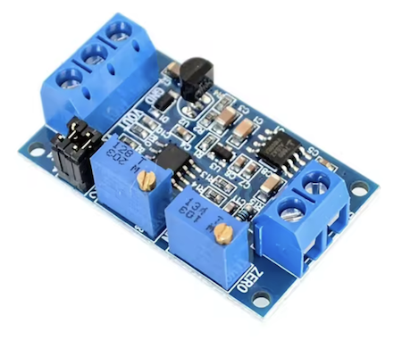
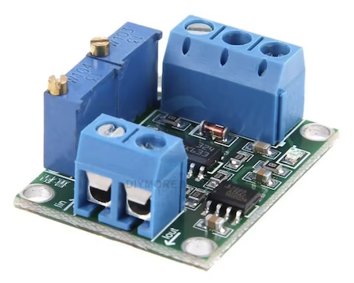

# ESP8266 Analog distance meter

Allows you to measure absolute & relative distance from an analog 0-10V or 4-20mA sensor and send it to MQTT.
It also provides HomeAssistant sensor autodiscovery.

This project was inspired by [WaterLevelSensorMQTT](https://github.com/portfedh/WaterLevelSensorMQTT).

## Required components

* NodeMCU ESP8266 Development Board ~4EUR
  * Recommend buying the one with built-in 0.96in display
* Any analog sensor, I used SWK-LT100 ~40EUR
* 4-20mA to 3V3 signal converter or 0-10V signal converter ~3EUR


4-20mA to 0-3V3 signal converters




Final result


## Setup

1. Connect the analog sensor output to the signal converter, and connect the converter's output to the `A0` pin on the ESP8266. Power the sensor according to its specifications.
2. Optional 128x64 OLED display can be connected - `D5` as `SCL` and `D6` as `SDA`. With a built-in display it works out of the box.
3. At first, the `WiFiManager` will set up an AccessPoint, connect to `ESP_distance_meter` WiFi, and then configure connection to your local network. Restart the NodeMCU when done.
4. Navigate with the browser to the device's IP address. It is displayed on the LCD or printed to Serial.
5. Enter all needed parameters in the admin dashboard.


### Configuring the analog sensor

The meter needs to know several parameters to correctly interpret the analog readings:

#### Sensor range (m)

The maximum range of your physical sensor in meters (e.g., 5 for a 0-5m sensor). This defines the mapping between the 4-20mA current (or 0-10V voltage) and the actual distance.

#### Distance from bottom to sensor (cm)

The height at which the sensor is installed, measured from the bottom of the tank/container in centimeters. This allows the system to calculate the actual water level.

#### Maximum water depth (cm)

The maximum possible water depth in your tank/container in centimeters. This is used to calculate the percentage full.

## Measurements

HomeAssistant's autoconfiguration message is published to MQTT. You should be able to find the Entity under MQTT integration.

By default, the current state will be published to the `esp_distance_meter/stat/distance` topic. It contains a JSON with the following structure:

* `relative` - a percentage of how much the container is filled.
* `absolute` - calculated height in meters of water in the container.
* `measured` - the raw distance measured in meters from the sensor to the water surface.

```json
{
    "relative": 0.73,
    "absolute": 1.12,
    "measured": 1.51
}
```

The example above shows that the container is filled to 73%, and the height of water is 1.12 meters. The raw measured distance from the sensor to the water surface is 1.51 meters.
